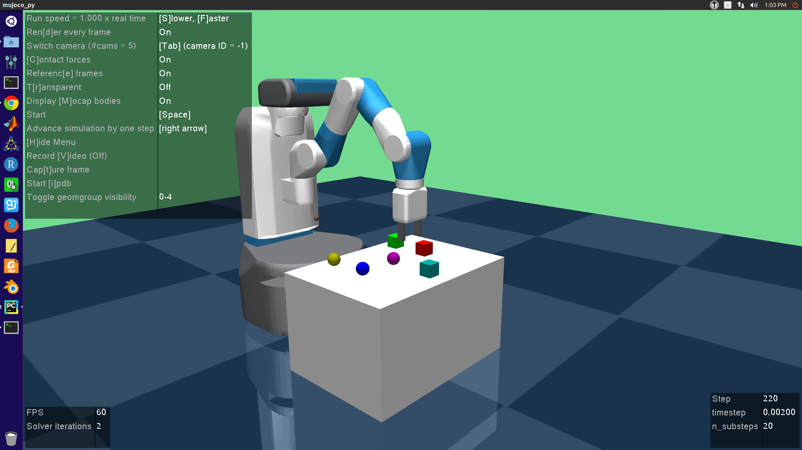
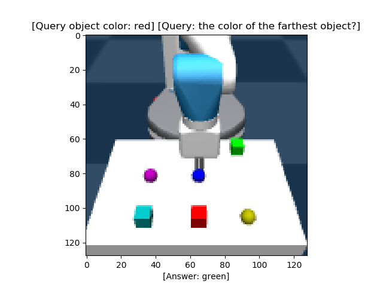
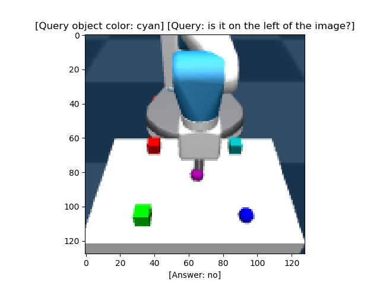
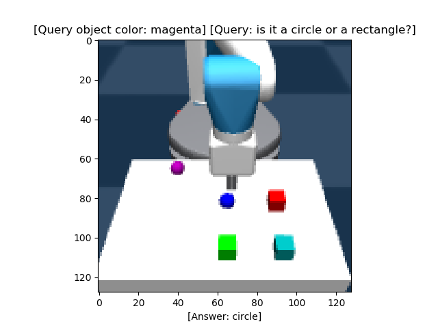

## Gym-rearrangement
A MuJoCo based environment used for robot rearrangement task


## Installation and usage
To install this package, just clone this repo to your local PC. Run `pip install -e .` under 
the package directory. To test if the package is successfully installed, run
```python
import gym_rearrangement
import gym
gym.make(ENV_ID)
```

## Examples
Basic usage:
```python
import gym
import gym_rearrangement

# Initialize the a rearrangement environment with 6 objects
env = gym.make("FetchRearrangement6-v1")
obs = env.reset()
for _ in range(1000):
    action = env.action_space.sample()
    obs, rew, done, info = env.step(action)
    env.render()
    if done:
        env.reset()
```
To use image observations, we implement the image env wrapper defined in 
`gym-reaarrangement/core/image_env.py`. An example  is shown below
```python
import gym
from PIL import Image
import os
import gym_rearrangement
from gym_rearrangement.core.image_env import ImageEnv

train_img_path = '/tmp/rearrange/train'
os.makedirs(train_img_path, exist_ok=True)

# Initialize the "rearrangement" environment
env = gym.make("FetchRearrangement3-v1")
# Image wrapper
env = ImageEnv(env, reward_type='img_distance', save_img=True, img_size=128)

obs = env.reset()
for i in range(500):
    action = env.action_space.sample()
    obs, rew, done, info = env.step(action)

    # reconstruct image
    im = obs['img_obs']
    im = env.recover_img(im)
    file_name = os.path.join(train_img_path, '{:0>3d}.png'.format(i))
    im = Image.fromarray(im)
    im.save(file_name)
    env.cv_render('external_camera_0') # render on screen with opencv
    if done:
        env.reset()
```
This wrapper will return a dict observation with keys: `observation, achieved_goal,
desired_goal, img_obs, img_achieved_goal, img_desired_goal`.
Algorithms used for learning gym-based tasks usually accepts observations with a gym.Box
or gym.Discrete type. To make it work for our task, you need to flat the env with
wrapper defined in `gym-rearrangement/core/flat_env.py`．

## Wrappers
We implement three main wrappers in total, they are:
- image wrapper: extended image observations on top of the original state observations
- frame stack wrapper: used for envs with image-based observations. It will stack a number of 
frames and feed them into your policy network
- flat wrapper: To covert dict observations in robotics env to Box or Discrete spaces observations 
which are compatible with the input of the rl algorithm

**Note:** Since the wrappers are used in specific conditions, the order to use them is a key factor.
For example, if you want to use the frame stack wrapper you need to wrapper a normal env with
the image wrapper. Generally, a typical script using image observations for RL is: 
```python
import gym
from gym_rearrangement.core.image_env import ImageEnv
from gym_rearrangement.core.flat_env import FlatGoalEnv
from gym_rearrangement.core.frame_stack import FrameStack


env = gym.make("FetchPickAndPlaceDense-v2")
env = ImageEnv(env, reward_type='wrapped_env', img_size=128)
env = FrameStack(env, n_frames=4)
env = FlatGoalEnv(env, obs_keys=['img_obs'])


obs = env.reset()
for i in range(500):
    action = env.action_space.sample()
    obs, rew, done, info = env.step(action)
    env.cv_render()  # render on screen with opencv
    if done:
        env.reset()
```

## Learning relations between objects
We implement codes to generate dataset including relation or non-relation questions,
which allow us to learn relations with graph neural networks. We argue that
relation is a key feature for rearrangement task. 
Some annotated samples are shown bellow:

  

## Supported environments
- FetchRearrangement{1,2,3,4,6}-v1: rearrangement task with 1,2,3,4,6 objects

**Note: You can do reward shaping for all of the environments by re-implement the compute_rewards method**

## References
- OpenAI gym: https://github.com/openai/gym
- Multiworld: https://github.com/vitchyr/multiworld
